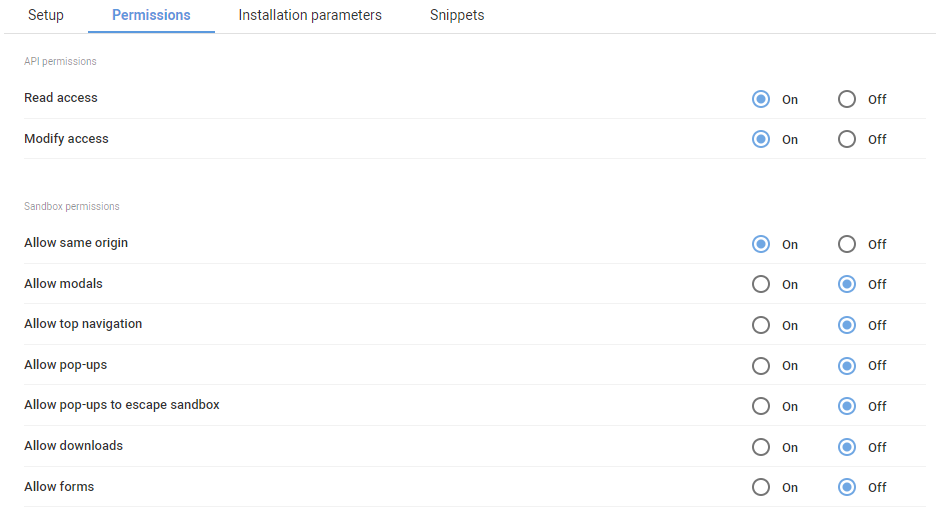

# Extension Setup

First you'll need to register the extension against an Amplience Dynamic Content Hub. General guidance can be found [here](https://amplience.com/developers/docs/integrations/extensions/register-use/) and following the specifics below:

Login to your Hub and head to Development > Extensions and click the "Register" button.

## Base Extension Setup

Under the setup tab put the URL where your extension is hosted:

-   Developement: This will either be `http://localhost:3000` of your dev branch deployement url
-   Self hosted: This will be your main brand deployement URL
-   Amplience hosted (if you are not self hosting): `https://ecomm-toolkit.dc-demostore.com`

## Extension Permissions Settings

Under the Permissions tab, select the following:

-   API Permissions:
    -   Read Access ✅
    -   Modify Access ✅
-   Sandbox Permissions:
    -   Allow Same Origin ✅

## Extensions Installation Parameters & Setup

Your `json` in the Installation Parameters will depend on the ecommerce platform you're connecting to.

-   [Salesforce Commerce Cloud (SFCC)](./commerce/sfcc.md)
-   [Big Commerce](./commerce/bigcommerce.md)
-   [Commerce Tools](./commerce/commercetools.md)
-   [Shopify](./commerce/shopify.md)
-   [Rest (JSON Sample Data)](./commerce/rest.md)
